# AO3 Rosé Pine — Closer to Home

A modified fork of [Rosé Pine for AO3](https://github.com/Wolfbatcat/ao3-rose-pine) by [Wolfbatcat](https://github.com/Wolfbatcat).

This fork restores some of the default AO3 interface aesthetics, bringing back a little of what makes AO3 feel like AO3 while keeping everything that makes the theme beautiful.🌷

## Preview

Preview Normal Layout

| Rosé Pine Dawn | Rosé Pine Moon | Rosé Pine |
| --- | --- | --- |
| 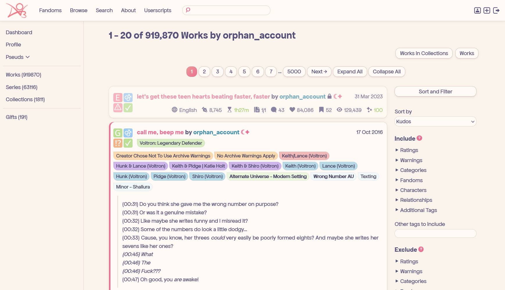 | 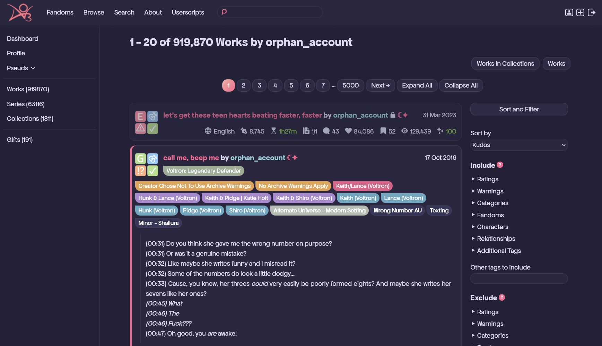 | 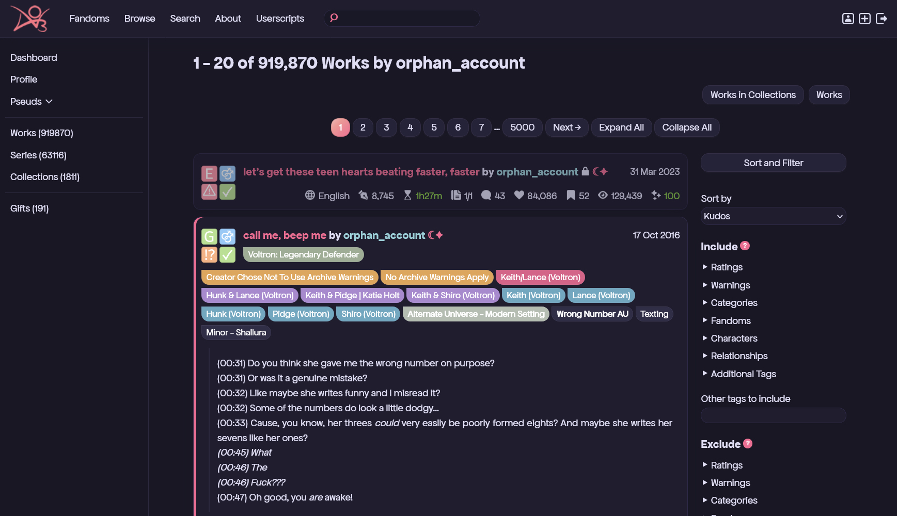 |

| Mobile | Tablet | Content Icons |
| --- | --- | --- |
| 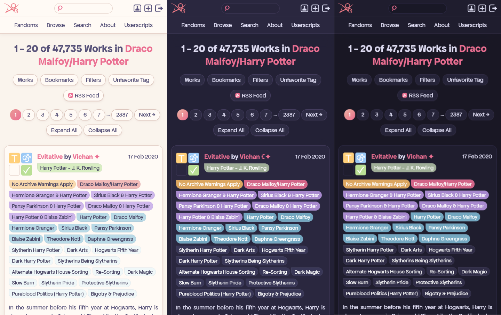 | 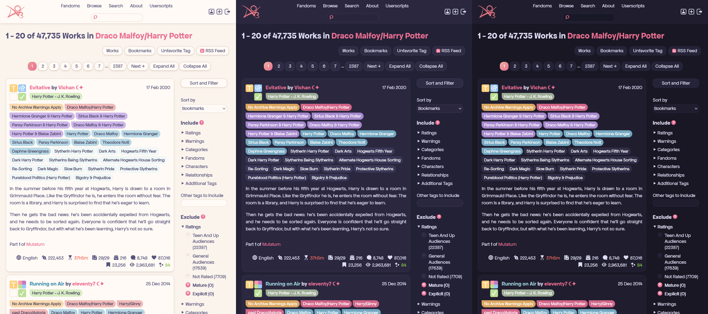 | 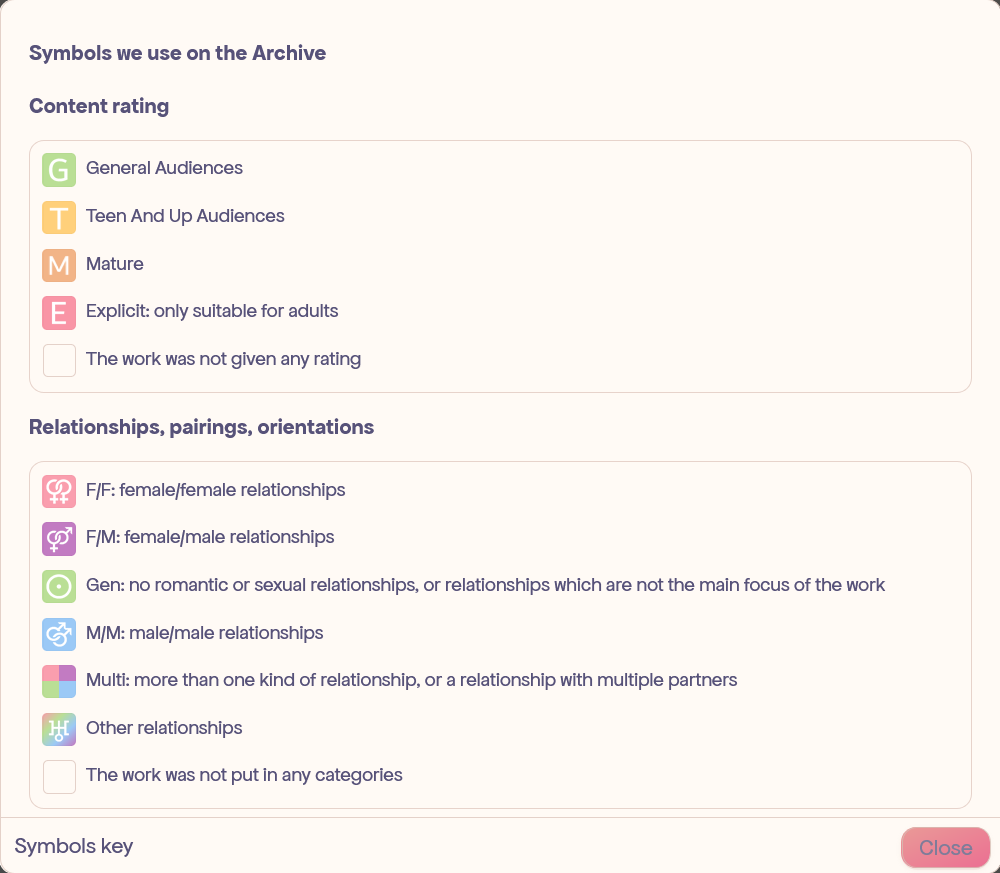 |

Preview Card Layout

| Rosé Pine Dawn | Rosé Pine Moon | Rosé Pine |
| --- | --- | --- |
| 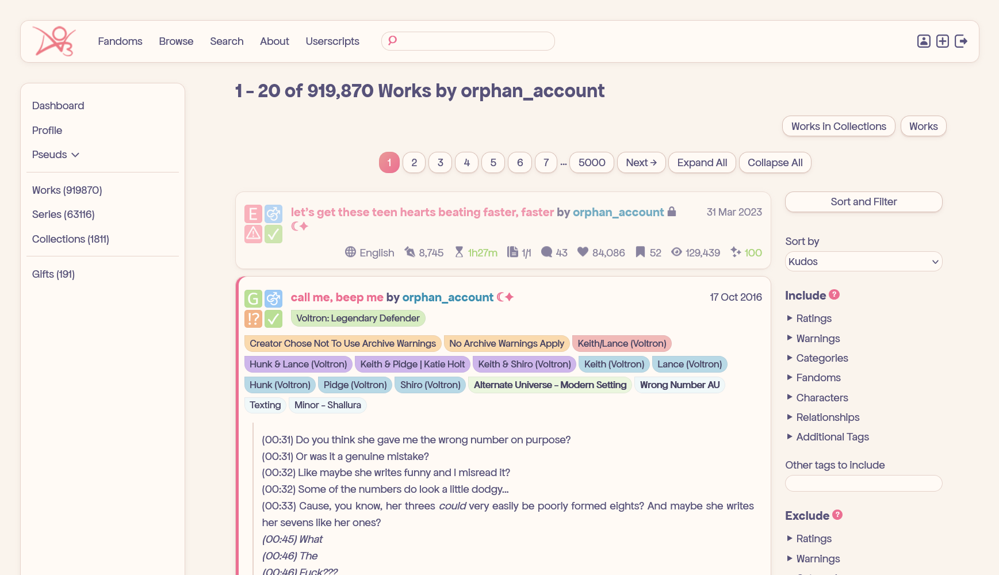 | 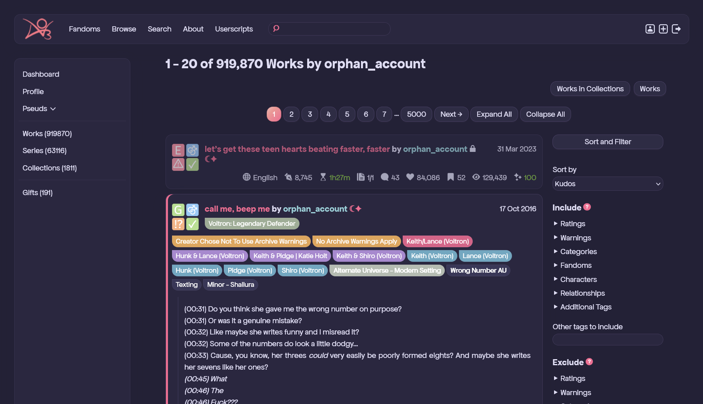 | 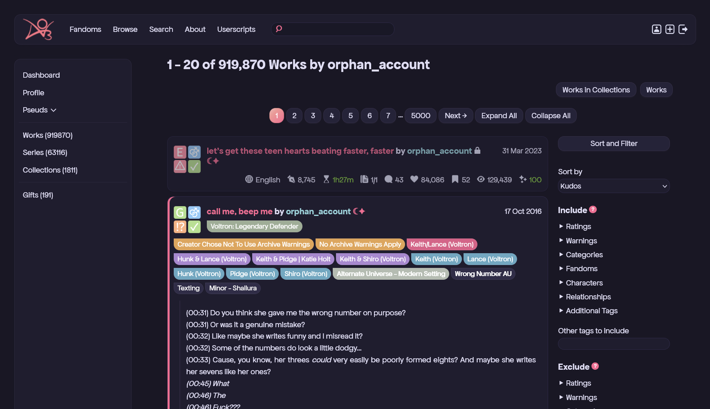 |

| Mobile | Tablet | Content Icons |
| --- | --- | --- |
| 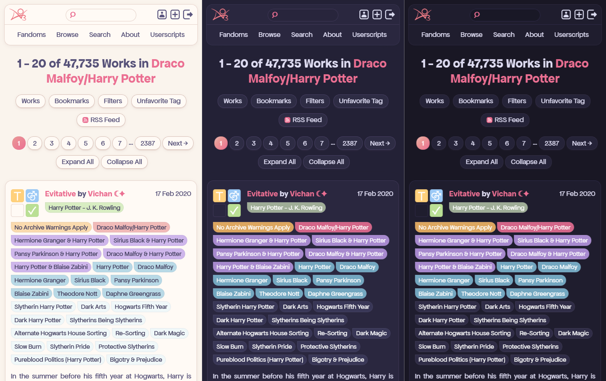 | 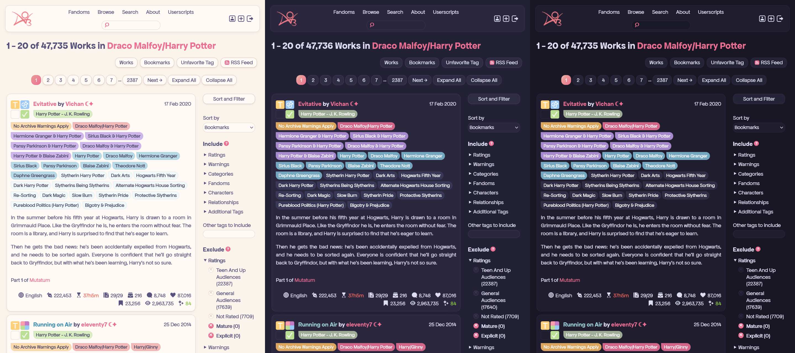 |  |

---

## ⚠️ Required Add-ons

This fork moves the fonts and AO3 title out of the main skin files into separate skins. **The theme will look incomplete without them.** Install these alongside the main skin:

| Add-on | Why it's needed | How to install |
|--------|----------------|----------------|
| [AO3 Logo in header](https://github.com/ravenothere/AO3-Tweaks/tree/main#ao3-logo-in-header) | Removes the " Archive of Our Own" text and keeps the AO3 logo at the header recolored in Rosé Pine tone | AO3 Skin |
| [Header Padding](https://github.com/ravenothere/AO3-Tweaks/tree/main?tab=readme-ov-file#header-padding) | Adds padding so the header sits right on desktop | [Stylus](https://github.com/ravenothere/AO3-Tweaks/tree/main?tab=readme-ov-file#stylus-css) |
| [Custom Fonts](https://github.com/ravenothere/AO3-Tweaks/tree/main?tab=readme-ov-file#custom-fonts---by-wolfbatcat) | Sets the custom site, headings, code, and work fonts | AO3 Skin |

> Extra standalone add-ons ([LGBTQ+ tags](https://github.com/ravenothere/AO3-Tweaks/tree/main#lgbtq-color-coded-tags), [EPUB button](https://github.com/ravenothere/AO3-Tweaks/tree/main#epub-download-button), and more) → Here: **[AO3-Tweaks](https://github.com/ravenothere/AO3-Tweaks)**
---

## What's Different

### [`base.css`](https://github.com/ravenothere/AO3-Rose-Pine-Closer-to-Home/blob/main/css/base.css) & [`base_alt.css`](https://github.com/ravenothere/AO3-Rose-Pine-Closer-to-Home/blob/main/css/base_alt.css)

| What changed | Section |
|-------------|---------|
| Header item alignment changed from `flex-start` to `center` — logo, text, and icons are now centered in the header for a more aligned look on desktop and tablet | Header |
| Removed the rule that hid the default AO3 logo and "Archive of Our Own beta" text — the logo is now restored via the [required add-on](https://github.com/ravenothere/AO3-Tweaks/tree/main#ao3-logo-in-header) above | Header |
| Removed the custom blurb header layout — fandom tags, rating icons, and work titles go back to their original AO3 positions | Blurb Header Layout |

> Both the Normal Layout ([`base.css`](https://github.com/ravenothere/AO3-Rose-Pine-Closer-to-Home/blob/main/css/base.css)) and Card Layout ([`base_alt.css`](https://github.com/ravenothere/AO3-Rose-Pine-Closer-to-Home/blob/main/css/base_alt.css)) received the same changes.

---

### [`theme_rosepinedawn.css`](https://github.com/ravenothere/AO3-Rose-Pine-Closer-to-Home/blob/main/css/theme_rosepinedawn.css), [`theme_rosepinemoon.css`](https://github.com/ravenothere/AO3-Rose-Pine-Closer-to-Home/blob/main/css/theme_rosepinemoon.css) & [`theme_rosepine.css`](https://github.com/ravenothere/AO3-Rose-Pine-Closer-to-Home/blob/main/css/theme_rosepine.css)

| What changed | Section |
|-------------|---------|
| Content icon border radius changed from `0.75rem` (fully round) to `0.25rem` (round-edged square, closer to default AO3) | Icon Border Radius |
| Main text size bumped from `100%` to `110%`, work text size from `110%` to `115%` — slightly larger to compensate for the custom font rendering smaller | Text Size |
| All content icon colors replaced with pastel tones closer to the default AO3 palette | Icon Colors |
| Tag background colors changed to softer pastels for easier readability | Tag Colors |
| Removed the fonts section — moved to a [separate skin](https://github.com/ravenothere/AO3-Tweaks/tree/main?tab=readme-ov-file#custom-fonts---by-wolfbatcat) (see [Required Add-ons](#️-required-add-ons)) | Fonts |
| Removed all text decorations (✿ in header title, dashboard tab, section headings, and freeform tags) | Text Decorations |

> All three theme files received the same changes. [`theme_rosepinedawn.css`](https://github.com/ravenothere/AO3-Rose-Pine-Closer-to-Home/blob/main/css/theme_rosepinedawn.css) additionally has explicit tag text colors set to `#464261` for better readability on the light background.

---

### [`mobile.css`](https://github.com/ravenothere/AO3-Rose-Pine-Closer-to-Home/blob/main/css/mobile.css) & [`mobile_alt.css`](https://github.com/ravenothere/AO3-Rose-Pine-Closer-to-Home/blob/main/css/mobile_alt.css)

| What changed | Section |
|-------------|---------|
| Removed the `"AO3 ✿"` header title fix — the [logo add-on](https://github.com/ravenothere/AO3-Tweaks/tree/main?tab=readme-ov-file#ao3-logo-in-header) handles the header on mobile | Header |

---

### [`tablet.css`](https://github.com/ravenothere/AO3-Rose-Pine-Closer-to-Home/blob/main/css/tablet.css) & [`tablet_alt.css`](https://github.com/ravenothere/AO3-Rose-Pine-Closer-to-Home/blob/main/css/tablet_alt.css)

No changes.

---

## Installation

### Choose Your Layout

Before you begin, decide which layout you prefer:

- **Normal Layout:** Uses [`base.css`](https://github.com/ravenothere/AO3-Rose-Pine-Closer-to-Home/blob/main/css/base.css), [`tablet.css`](https://github.com/ravenothere/AO3-Rose-Pine-Closer-to-Home/blob/main/css/tablet.css), and [`mobile.css`](https://github.com/ravenothere/AO3-Rose-Pine-Closer-to-Home/blob/main/css/mobile.css)
- **Card Layout:** Uses [`base_alt.css`](https://github.com/ravenothere/AO3-Rose-Pine-Closer-to-Home/blob/main/css/base_alt.css), [`tablet_alt.css`](https://github.com/ravenothere/AO3-Rose-Pine-Closer-to-Home/blob/main/css/tablet_alt.css), and [`mobile_alt.css`](https://github.com/ravenothere/AO3-Rose-Pine-Closer-to-Home/blob/main/css/mobile_alt.css)

Check the [previews above](#preview) to see which style you prefer, then follow the instructions below using the files for your chosen layout. Note that both layouts use the same theme files, so you can pick any theme you like regardless of which layout you choose.

<b>Step 1 — Create the base skin</b>

1. Go to **Dashboard → Skins → My Site Skins → [Create Site Skin](https://archiveofourown.org/skins/new?skin_type=Skin)**
2. Name it `[XYZ] Rosé Pine CTH - Base` — Replace `XYZ` with your username or initials.
3. Paste the contents of your chosen base file:
   - Normal layout → [`css/base.css`](https://github.com/ravenothere/AO3-Rose-Pine-Closer-to-Home/blob/main/css/base.css)
   - Card layout → [`css/base_alt.css`](https://github.com/ravenothere/AO3-Rose-Pine-Closer-to-Home/blob/main/css/tablet_alt.css)
4. Under **Advanced**, set to **Parent Only**
5. Click **Submit**

<b>Step 2 — Create a theme skin</b>

1. Create a skin named `[XYZ] Rosé Pine Dawn CTH`, `[XYZ] Rosé Pine Moon CTH`, or `[XYZ] Rosé Pine CTH` — Replace `XYZ` with your username or initials.
2. Paste the contents of your chosen theme file:
   - [`css/theme_rosepinedawn.css`](https://github.com/ravenothere/AO3-Rose-Pine-Closer-to-Home/blob/main/css/theme_rosepinedawn.css)
   - [`css/theme_rosepinemoon.css`](https://github.com/ravenothere/AO3-Rose-Pine-Closer-to-Home/blob/main/css/theme_rosepinemoon.css)
   - [`css/theme_rosepine.css`](https://github.com/ravenothere/AO3-Rose-Pine-Closer-to-Home/blob/main/css/theme_rosepine.css)
3. Set to **Parent Only** and submit

> The other theme variants (Moon Cool, Rosé Pine Cool) were not modified in this fork.

<b>Step 2a — Auto light/dark switching (optional)</b>

1. Create a second theme skin (e.g. [Dawn](https://github.com/ravenothere/AO3-Rose-Pine-Closer-to-Home/blob/main/css/theme_rosepinedawn.css) for light, [Moon]((https://github.com/ravenothere/AO3-Rose-Pine-Closer-to-Home/blob/main/css/theme_rosepinemoon.css)) for dark)
2. On your dark theme skin, go to **Advanced → Choose @media** → select `(prefers-color-scheme: dark)`
3. On your light theme skin, select `(prefers-color-scheme: light)`
4. Add both in the parent chain at Step 5 — they'll switch automatically based on your system settings

<b>Step 3 — Install the required add-ons</b>

Before chaining the skins, install these three from [AO3 Tweaks](https://github.com/ravenothere/AO3-Tweaks):

**[AO3 Logo in header](https://github.com/ravenothere/AO3-Tweaks/tree/main#ao3-logo-in-header)**
1. Create a skin named `[XYZ] Rosé Pine - Logo`
2. Paste the [CSS](https://github.com/ravenothere/AO3-Tweaks/blob/main/add-ons/CSS/only-logo-in-header-Colored.css) from the add-on
3. Set to **Parent Only** and submit

**[Header Padding](https://github.com/ravenothere/AO3-Tweaks/tree/main?tab=readme-ov-file#header-padding)** — *you can skip this if you don't use desktop or aren't bothered by the [logo snapping to the borders of the header](https://raw.githubusercontent.com/ravenothere/AO3-Tweaks/main/images/header-padding.png)*
- Install via the [Stylus](https://github.com/openstyles/stylus) browser extension — instructions in the [AO3 Tweaks readme](https://github.com/ravenothere/AO3-Tweaks/tree/main?tab=readme-ov-file#header-padding)
- This one doesn't go in the AO3 parent chain, Stylus handles it separately

**[Custom Fonts](https://github.com/ravenothere/AO3-Tweaks/tree/main?tab=readme-ov-file#custom-fonts---by-wolfbatcat)**
1. Create a skin named `[XYZ] Rosé Pine - Fonts`
2. Paste the CSS from the add-on
3. Set to **Parent Only** and submit

>if you want your custom fonts to show up on your mobile check out my [Custom Fonts for Mobile](https://github.com/ravenothere/AO3-Tweaks/tree/main?tab=readme-ov-file#custom-fonts-for-mobile) CSS on [AO3 Tweaks](https://github.com/ravenothere/AO3-Tweaks) the full instructions are there

<b>Step 4 — Create the tablet skin</b>

1. Create a skin named `[XYZ] Rosé Pine - Tablet`
2. Paste the contents of your chosen tablet file:
   - Normal layout → [`css/tablet.css`](https://github.com/ravenothere/AO3-Rose-Pine-Closer-to-Home/blob/main/css/tablet.css)
   - Card layout → [`css/tablet_alt.css`](https://github.com/ravenothere/AO3-Rose-Pine-Closer-to-Home/blob/main/css/tablet_alt.css)
3. Under **Advanced → Choose @media**, select `only screen (max-width: 62em)`
4. Set to **Parent Only** and submit

<b>Step 5 — Create the mobile skin</b>

1. Create a skin named `[XYZ] Rosé Pine - Mobile`
2. Paste the contents of your chosen mobile file:
   - Normal layout → [`css/mobile.css`](https://github.com/ravenothere/AO3-Rose-Pine-Closer-to-Home/blob/main/css/mobile.css)
   - Card layout → [`css/mobile_alt.css`](https://github.com/ravenothere/AO3-Rose-Pine-Closer-to-Home/blob/main/css/mobile_alt.css)
3. Under **Advanced → Choose @media**, select `only screen (max-width: 42em)`
4. Set to **Parent Only** and submit

<b>Step 6 — Chain everything together</b>

1. Create one final skin named `[XYZ] Rosé Pine CTH - Default`
2. In the CSS field paste: `.rose-pine { opacity: 1; }` (placeholder so AO3 lets you save)
3. Under **Advanced → Parent Skins**, add them in this order:
   1. `[XYZ] Rosé Pine CTH - Base`
   2. `[XYZ] Rosé Pine Dawn CTH` / `[XYZ] Rosé Pine Moon CTH` / `[XYZ] Rosé Pine CTH` *(or both if using auto switching)*
   3. `[XYZ] Rosé Pine CTH - Logo`
   4. `[XYZ] Rosé Pine CTH - Fonts`
   5. `[XYZ] Rosé Pine CTH - Tablet`
   6. `[XYZ] Rosé Pine CTH - Mobile`
4. Click **Submit** then **Use**

---

## Credits

All credit for the original skin goes to [Wolfbatcat](https://github.com/Wolfbatcat/ao3-rose-pine).  
and [neos by ZerafinaCSS](https://github.com/ZerafinaCSS/neos) as its foundation.