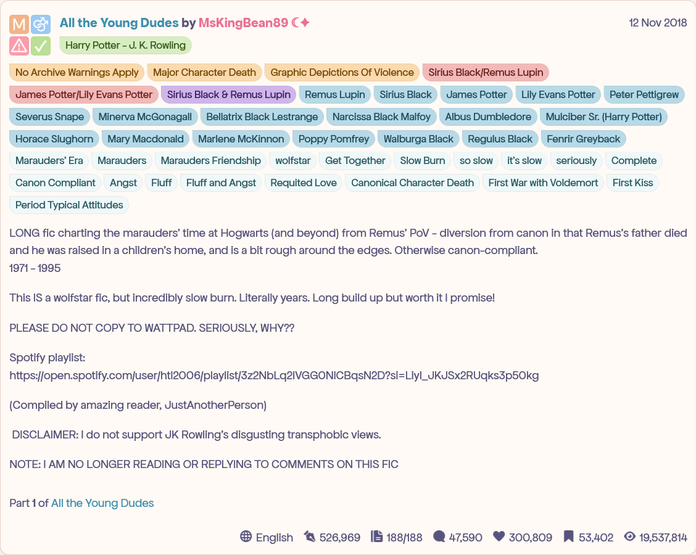
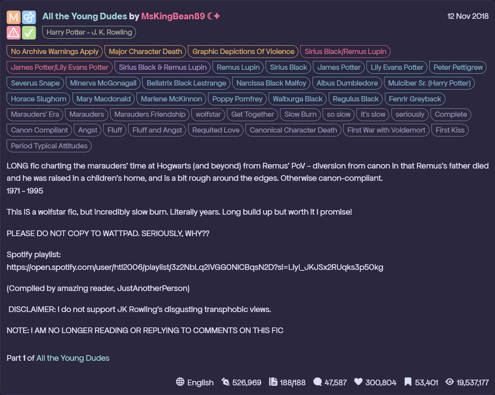

# AO3 Rosé Pine — Closer to Home

A modified fork of [Rosé Pine for AO3](https://github.com/Wolfbatcat/ao3-rose-pine) by [Wolfbatcat](https://github.com/Wolfbatcat).

This fork restores some of the default AO3 interface aesthetics, bringing back a little of what makes AO3 feel like AO3 while keeping everything that makes the theme beautiful.🌷

## Preview

<details>
<summary>Preview Normal Layout</summary>

| Rosé Pine Dawn | Rosé Pine Moon | Rosé Pine |
| --- | --- | --- |
|  |  |  |

| Mobile | Tablet | Content Icons |
| --- | --- | --- |
|  |  |  |

</details>

<details>
<summary>Preview Card Layout</summary>

| Rosé Pine Dawn | Rosé Pine Moon | Rosé Pine |
| --- | --- | --- |
|  |  |  |

| Mobile | Tablet | Content Icons |
| --- | --- | --- |
|  |  |  |

</details>

<details>
<summary>Preview Alternative Tag Style</summary>

| Rosé Pine Dawn (Style B) | Rosé Pine / Rosé Pine Moon (Style B) |
| --- | --- |
|  |  |

</details>

---

## Installation

### Choose Your Layout

Before you begin, decide which layout you prefer:

- **Normal Layout:** Uses [`CTH_base.css`](https://github.com/ravenothere/AO3-Rose-Pine-Closer-to-Home/blob/main/css/CTH_base.css), [`CTH_tablet.css`](https://github.com/ravenothere/AO3-Rose-Pine-Closer-to-Home/blob/main/css/CTH_tablet.css), and [`CTH_mobile.css`](https://github.com/ravenothere/AO3-Rose-Pine-Closer-to-Home/blob/main/css/CTH_mobile.css)
- **Card Layout:** Uses [`CTH_base_card.css`](https://github.com/ravenothere/AO3-Rose-Pine-Closer-to-Home/blob/main/css/CTH_base_card.css), [`CTH_tablet_card.css`](https://github.com/ravenothere/AO3-Rose-Pine-Closer-to-Home/blob/main/css/CTH_tablet_card.css), and [`CTH_mobile_card.css`](https://github.com/ravenothere/AO3-Rose-Pine-Closer-to-Home/blob/main/css/CTH_mobile_card.css)

Check the [previews above](#preview) to see which style you prefer, then follow the instructions below using the files for your chosen layout. Note that both layouts use the same theme files, so you can pick any theme you like regardless of which layout you choose.

<details>
<summary><b>Step 1 — Create the base skin</b></summary>

1. Go to **Dashboard → Skins → My Site Skins → [Create Site Skin](https://archiveofourown.org/skins/new?skin_type=Skin)**
2. Name it `[XYZ] Rosé Pine CTH - Base` — Replace `XYZ` with your username or initials.
3. Paste the contents of your chosen base file:
   - Normal layout → [`css/CTH_base.css`](https://github.com/ravenothere/AO3-Rose-Pine-Closer-to-Home/blob/main/css/CTH_base.css)
   - Card layout → [`css/CTH_base_card.css`](https://github.com/ravenothere/AO3-Rose-Pine-Closer-to-Home/blob/main/css/CTH_base_card.css)
4. Under **Advanced**, set to **Parent Only**
5. Click **Submit**

</details>

<details>
<summary><b>Step 2 — Create a theme skin</b></summary>

1. Create a skin named `[XYZ] Rosé Pine Dawn CTH`, `[XYZ] Rosé Pine Moon CTH`, or `[XYZ] Rosé Pine CTH` — Replace `XYZ` with your username or initials.
2. Paste the contents of your chosen theme file:
   - [`css/CTH_theme_rosepinedawn.css`](https://github.com/ravenothere/AO3-Rose-Pine-Closer-to-Home/blob/main/css/CTH_theme_rosepinedawn.css)
   - [`css/CTH_theme_rosepinemoon.css`](https://github.com/ravenothere/AO3-Rose-Pine-Closer-to-Home/blob/main/css/CTH_theme_rosepinemoon.css)
   - [`css/CTH_theme_rosepine.css`](https://github.com/ravenothere/AO3-Rose-Pine-Closer-to-Home/blob/main/css/CTH_theme_rosepine.css)
3. Set to **Parent Only** and submit

</details>

<details>
<summary><b>Step 2a — Auto light/dark switching (optional)</b></summary>

1. Create a second theme skin (e.g. [Dawn](https://github.com/ravenothere/AO3-Rose-Pine-Closer-to-Home/blob/main/css/CTH_theme_rosepinedawn.css) for light, [Moon](https://github.com/ravenothere/AO3-Rose-Pine-Closer-to-Home/blob/main/css/CTH_theme_rosepinemoon.css) for dark)
2. Paste the CSS from your second theme, set to **Parent Only**
3. On your **dark theme skin**, go to **Advanced → Choose @media** → select `(prefers-color-scheme: dark)`
4. On your **light theme skin**, select `(prefers-color-scheme: light)`
5. When you get to Step 5, add **both** theme skins to the parent chain — they'll switch automatically

> **Known AO3 bug:** The skin editor sometimes doesn't save @media settings properly when editing an existing skin. If you run into this, delete the skin and create a new one with the correct settings.

</details>

<details>
<summary><b>Step 2b — Alternative tag style (optional)</b></summary>

Want a different tag style? This optional add-on changes how tags appear throughout the site. [Previews above.](#preview)

1. Create a skin named `[XYZ] Rosé Pine CTH - Tag Mod`
2. Paste the code from the tag mod file that matches your theme:
   - For Rosé Pine Dawn → [`css/extras/tags/CTH_tags_rosepinedawn_b.css`](https://github.com/ravenothere/AO3-Rose-Pine-Closer-to-Home/blob/main/css/extras/tags/CTH_tags_rosepinedawn_b.css)
   - For Rosé Pine & Rosé Pine Moon → [`css/extras/tags/CTH_tags_rosepine_b.css`](https://github.com/ravenothere/AO3-Rose-Pine-Closer-to-Home/blob/main/css/extras/tags/CTH_tags_rosepine_b.css)
3. Set to **Parent Only** and submit

</details>

<details>
<summary><b>Step 3 — Create the tablet skin</b></summary>

> **Important:** The tablet and mobile skins are required — the theme won't display correctly without them.

1. Create a skin named `[XYZ] Rosé Pine CTH - Tablet`
2. Paste the contents of your chosen tablet file:
   - Normal layout → [`css/CTH_tablet.css`](https://github.com/ravenothere/AO3-Rose-Pine-Closer-to-Home/blob/main/css/CTH_tablet.css)
   - Card layout → [`css/CTH_tablet_card.css`](https://github.com/ravenothere/AO3-Rose-Pine-Closer-to-Home/blob/main/css/CTH_tablet_card.css)
3. Under **Advanced → Choose @media**, select `only screen (max-width: 62em)`
4. Set to **Parent Only** and submit

</details>

<details>
<summary><b>Step 4 — Create the mobile skin</b></summary>

1. Create a skin named `[XYZ] Rosé Pine CTH - Mobile`
2. Paste the contents of your chosen mobile file:
   - Normal layout → [`css/CTH_mobile.css`](https://github.com/ravenothere/AO3-Rose-Pine-Closer-to-Home/blob/main/css/CTH_mobile.css)
   - Card layout → [`css/CTH_mobile_card.css`](https://github.com/ravenothere/AO3-Rose-Pine-Closer-to-Home/blob/main/css/CTH_mobile_card.css)
3. Under **Advanced → Choose @media**, select `only screen (max-width: 42em)`
4. Set to **Parent Only** and submit

</details>

<details>
<summary><b>Step 5 — Chain everything together</b></summary>

1. Create one final skin named `[XYZ] Rosé Pine CTH - Default`
2. In the CSS field paste: `.rose-pine { opacity: 1; }` (placeholder so AO3 lets you save)
3. Under **Advanced → Parent Skins**, add them in this order:
   1. `[XYZ] Rosé Pine CTH - Base`
   2. **Single theme:** your theme skin (e.g. `[XYZ] Rosé Pine Dawn CTH`)
      **OR for auto switching:** add *both* of your theme skins — order doesn't matter since they use @media queries
   3. **(Optional)** `[XYZ] Rosé Pine CTH - Tag Mod` — only if you created the alternative tag style skin in Step 2b
   4. `[XYZ] Rosé Pine CTH - Tablet`
   5. `[XYZ] Rosé Pine CTH - Mobile`
4. Click **Submit** then **Use**

</details>

---

## Customization

<details>
<summary><b>Fonts</b></summary>
   
***Fonts:** This skin uses [Apfel Grotezk](https://www.collletttivo.it/typefaces/apfel-grotezk) (sans-serif) for body text, [Apfel Grotezk Fett](https://www.collletttivo.it/typefaces/apfel-grotezk) (sans-serif) for headings, and [Domine](https://fonts.google.com/specimen/Domine) as the works/reader font. Code snippets use [Victor Mono](https://rubjo.github.io/victor-mono/). If you want the cursive variant of the code font, remove the comments from `/* font-style: italic; */` in your theme file. [Merriweather](https://fonts.google.com/specimen/Merriweather) (serif) and [Figtree](https://fonts.google.com/specimen/Figtree) (sans-serif) also pair well with the skin if you fancy something different.*
   
To change fonts, open your base skin and use Ctrl+F to search for `font-family`. You'll find four blocks — one for the main site font, one for headings, one for code, and one for works. Replace the first font name in each with your preferred font, keeping the fallbacks:

```css
font-family: YourFont, Apfel Grotezk, Figtree, Bitter, Helvetica, Arial, sans-serif;
```

> **Important:** The fonts must be installed on your device for them to display. If a font isn't installed, the browser will fall back to the next one in the list.

**On mobile:** AO3 can only display fonts already installed on your device. Since installing fonts system-wide on Android doesn't make them available to browsers, the recommended approach is to use the [Stylus](https://addons.mozilla.org/en-US/firefox/addon/styl-us/) extension on Firefox for Android — it can load fonts directly into the browser without needing them installed on your device. The [AO3: Rosé Pine Fonts](https://userstyles.world/style/26908/ao3-rose-pine-fonts) userstyle has the fonts for this skin ready to go — just install it and you're done. If you want to use your own custom fonts on mobile instead, see my [Custom Fonts for Mobile](https://github.com/ravenothere/AO3-Tweaks/tree/main?tab=readme-ov-file#custom-fonts-for-mobile) guide.

</details>

<details>
<summary><b>Font size</b></summary>

In your base skin, find these two variables near the top:

```css
--txt-size-main: 110%;   /* main text size */
--txt-size-work: 115%;   /* work text size */
```

`--txt-size-main` controls text across the whole site (navigation, blurbs, forms, etc.), while `--txt-size-work` is just for the actual work content. Increase the percentage for larger text or decrease it for smaller. Going above `130%` for `--txt-size-main` may cause minor layout issues.

</details>

<details>
<summary><b>Tag colors</b></summary>

Want to change up the tag colors? The variables are in the `TAG COLORS` section near the top of your theme file:

```css
/*>========== TAG COLORS ==========<*/

  /* BACKGROUND */
  --tag-default-bg:      #f0f8f9;
  --tag-fandom-bg:       #d8edc2;
  --tag-warning-bg:      #fadaae;
  --tag-ship-bg:         #f1bab8;
  --tag-character-bg:    #b8d9e6;
  --tag-freeform-bg:     var(--tag-default-bg);
  --tag-splash-bg:       #F6ECE3;

  /* TEXT */
  --tag-default-txt:     #464261;
  --tag-fandom-txt:      #464261;
  --tag-warning-txt:     #464261;
  --tag-ship-txt:        #464261;
  --tag-character-txt:   #464261;
  --tag-freeform-txt:    #464261;
```

Just swap out the hex color values with whatever you like. You can also tweak the text color for each tag type using the `--tag-*-txt` variables.

> **Note:** Leave `--tag-splash-bg` alone — it's specifically for the splash page and doesn't affect regular tag colors.

> **If you're using the Alternative Tag Style add-on (Step 2b):** Change the tag colors in the tag add-on skin instead of the theme skin. The border and text colors are controlled by the tag text variables (like `--tag-default-txt`).

</details>

<details>
<summary><b>Platonic ship tags</b></summary>

Want platonic ships (relationships with the `&` symbol) to stand out with their own color? Here are pre-made add-on skins with the distinction already built in:

**Style A (default tag style):**
- [`css/extras/tags/CTH_tags_rosepinedawn_a_plat.css`](https://github.com/ravenothere/AO3-Rose-Pine-Closer-to-Home/blob/main/css/extras/tags/CTH_tags_rosepinedawn_a_plat.css) — For Rosé Pine Dawn
- [`css/extras/tags/CTH_tags_rosepine_a_plat.css`](https://github.com/ravenothere/AO3-Rose-Pine-Closer-to-Home/blob/main/css/extras/tags/CTH_tags_rosepine_a_plat.css) — For Rosé Pine
- [`css/extras/tags/CTH_tags_rosepinemoon_a_plat.css`](https://github.com/ravenothere/AO3-Rose-Pine-Closer-to-Home/blob/main/css/extras/tags/CTH_tags_rosepinemoon_a_plat.css) — For Rosé Pine Moon

**Style B (alternative tag style):**
- [`css/extras/tags/CTH_tags_rosepinedawn_b_plat.css`](https://github.com/ravenothere/AO3-Rose-Pine-Closer-to-Home/blob/main/css/extras/tags/CTH_tags_rosepinedawn_b_plat.css) — For Rosé Pine Dawn
- [`css/extras/tags/CTH_tags_rosepine_b_plat.css`](https://github.com/ravenothere/AO3-Rose-Pine-Closer-to-Home/blob/main/css/extras/tags/CTH_tags_rosepine_b_plat.css) — For Rosé Pine and Rosé Pine Moon

Add whichever matches your theme and style to the parent chain after your theme skin (or after the tag mod skin if you're using one). If you're using auto light/dark switching, add both.

Recommended to use alongside [AO3: Reorder Ship Tags](https://greasyfork.org/en/scripts/562812-ao3-reorder-ship-tags).

</details>

<details>
<summary><b>Original Rosé Pine colors</b></summary>

prefer the original Rosé Pine color palette? you can swap in one of these theme skins instead of my Closer to Home ones — everything else in the installation steps stays the same.

- [Rosé Pine Dawn](https://github.com/Wolfbatcat/ao3-rose-pine/blob/main/css/extras/cth/theme_rosepinedawn_cth.css)
- [Rosé Pine Moon](https://github.com/Wolfbatcat/ao3-rose-pine/blob/main/css/extras/cth/theme_rosepinemoon_cth.css)
- [Rosé Pine Moon Cool](https://github.com/Wolfbatcat/ao3-rose-pine/blob/main/css/extras/cth/theme_rosepinemooncool_cth.css)
- [Rosé Pine](https://github.com/Wolfbatcat/ao3-rose-pine/blob/main/css/extras/cth/theme_rosepine_cth.css)
- [Rosé Pine Cool](https://github.com/Wolfbatcat/ao3-rose-pine/blob/main/css/extras/cth/theme_rosepinecool_cth.css)

here are also the original [Rosé Pine alternative tags](https://github.com/Wolfbatcat/ao3-rose-pine/tree/main/css/extras/tags) if you're using the alternative tag style.
</details>

<details>
<summary><b>Text Decorations</b></summary>

This skin removes all text decorations from the original Rosé Pine by default (the `✿` symbols on heading titles, dashboard tabs, section headings, and freeform tags). You can add them back with the optional Text Decorations add-on.
 
1. Create a skin named `[XYZ] Rosé Pine CTH - Text Decorations`
2. Paste the contents of [`css/extras/CTH_text_decorations.css`](https://github.com/ravenothere/AO3-Rose-Pine-Closer-to-Home/blob/main/css/extras/CTH_text_decorations.css)
3. Set to **Parent Only** and submit
4. Add it to your parent chain in Step 5, after your theme skin (or after the tag mod skin if you're using one)

> you can  Swap out ✦ in the code for whatever symbol you want (♥, ✿, ʚ, etc.).

</details>

<details>
<summary><b>Layout Toggles</b></summary>

A few optional display settings are available in the `LAYOUT TOGGLES` section near the top of your base skin. To change them, find the variable and update its value:

- **Profile picture in the header:** Your user avatar can be shown next to the header icons. Change `--greeting-icon-display: none;` to `--greeting-icon-display: flex;`
- **Social share buttons on the homepage:** AO3's social media share buttons on the splash page are hidden by default. Change `--splash-social-display: none;` to `--splash-social-display: inline;`
- **Footer:** The footer is shown by default. Change `--footer-display: inline;` to `--footer-display: none;` to hide it.

</details>

---

## More Add-ons

Want to take things further? Check out my **[AO3 Tweaks](https://github.com/ravenothere/AO3-Tweaks)** — a collection of standalone add-ons that work with any AO3 skin, including this one:

- **[LGBTQ+ color coded tags](https://github.com/ravenothere/AO3-Tweaks#lgbtq-color-coded-tags)** — highlight LGBTQ+ related tags with their corresponding pride flag colors
- **[EPUB download button](https://github.com/ravenothere/AO3-Tweaks#epub-download-button)** — adds an EPUB download button directly on work blurbs while you're browsing
- ...and a growing list of small quality-of-life tweaks

Drop any of them into your parent chain and they just work!

---

## What's Different

### [`CTH_base.css`](https://github.com/ravenothere/AO3-Rose-Pine-Closer-to-Home/blob/main/css/CTH_base.css) & [`CTH_base_card.css`](https://github.com/ravenothere/AO3-Rose-Pine-Closer-to-Home/blob/main/css/CTH_base_card.css)

| What changed | Section |
|-------------|---------|
| Content icon border radius changed from `0.75rem` (fully round) to `0.25rem` (round-edged square, closer to default AO3) | Icon Border Radius |
| Main text size bumped from `100%` to `110%`, work text size from `110%` to `115%` — slightly larger to compensate for the custom font rendering smaller | Text Size |
| Changed the fonts and added work fonts — check out the [Customization](#customization) section to add your own | Fonts |
| Removed all text decorations (✿ in header title, dashboard tab, section headings, and freeform tags — can be added as an add-on in [customization](#customization)) | Text Decorations |
| Header item alignment changed from `flex-start` to `center` — logo, text, and icons are now centered in the header for a more aligned look on desktop and tablet | Header |
| Logo color changed to match the theme using the `--header-icon-hgl` variable | Header |
| Logo filter uses `--header-icon-hgl` at rest, switching to `--header-icon` on hover/focus — adds a hover effect | Header |
| Added `padding-block: 0.5em` to the header so the logo has breathing room from the top and bottom edges on desktop | Header |
| Fixed collection banner spacing — the `padding-block` added to the header was leaking below the collection name banner, so bottom padding is now removed via `#header:has(h2)` when a collection name is present, with the `h2` getting its own `margin-top` and `padding` instead | Collections Header |
| Removed the custom blurb header layout — fandom tags, rating icons, and work titles go back to their original AO3 positions | Blurb Header Layout |
| Adjusted bookmark blurb title padding from `14ch` to `6ch` so it sits right on smaller screens | Bookmark Blurb Layout |
| Tweaked the "warning: yes" content icon `background-position` by 1px for better alignment | Icon Alignment |

> Both the Normal Layout ([`CTH_base.css`](https://github.com/ravenothere/AO3-Rose-Pine-Closer-to-Home/blob/main/css/CTH_base.css)) and Card Layout ([`CTH_base_card.css`](https://github.com/ravenothere/AO3-Rose-Pine-Closer-to-Home/blob/main/css/CTH_base_card.css)) received the same changes.

---

### [`CTH_theme_rosepinedawn.css`](https://github.com/ravenothere/AO3-Rose-Pine-Closer-to-Home/blob/main/css/CTH_theme_rosepinedawn.css), [`CTH_theme_rosepinemoon.css`](https://github.com/ravenothere/AO3-Rose-Pine-Closer-to-Home/blob/main/css/CTH_theme_rosepinemoon.css) & [`CTH_theme_rosepine.css`](https://github.com/ravenothere/AO3-Rose-Pine-Closer-to-Home/blob/main/css/CTH_theme_rosepine.css)

| What changed | Section |
|-------------|---------|
| All content icon colors replaced with pastel tones closer to the default AO3 palette | Icon Colors |
| Tag background colors changed to softer pastels for easier readability | Tag Colors |

> All three theme files received the same changes. [`CTH_theme_rosepinedawn.css`](https://github.com/ravenothere/AO3-Rose-Pine-Closer-to-Home/blob/main/css/CTH_theme_rosepinedawn.css) additionally has explicit tag text colors set to `#464261` for better readability on the light background.

---

### [`CTH_mobile.css`](https://github.com/ravenothere/AO3-Rose-Pine-Closer-to-Home/blob/main/css/CTH_mobile.css) & [`CTH_mobile_card.css`](https://github.com/ravenothere/AO3-Rose-Pine-Closer-to-Home/blob/main/css/CTH_mobile_card.css)

| What changed | Section |
|-------------|---------|
| Removed the `"AO3 ✿"` header title fix — handled directly in the skin | Header |
| Added `padding-block: 0` to reset the header padding added in the base skin — keeps the layout compact | Header |

---

### [`CTH_tablet.css`](https://github.com/ravenothere/AO3-Rose-Pine-Closer-to-Home/blob/main/css/CTH_tablet.css) & [`CTH_tablet_card.css`](https://github.com/ravenothere/AO3-Rose-Pine-Closer-to-Home/blob/main/css/CTH_tablet_card.css)

| What changed | Section |
|-------------|---------|
| Added `padding-block: 0` to reset the header padding added in the base skin — keeps the layout compact | Header |

---

## Credits

All credit for the original skin goes to [Wolfbatcat](https://github.com/Wolfbatcat/ao3-rose-pine), built on [neos by ZerafinaCSS](https://github.com/ZerafinaCSS/neos).
