# AO3 Rosé Pine — Closer to Home

A modified fork of [Rosé Pine for AO3](https://github.com/Wolfbatcat/ao3-rose-pine) by [Wolfbatcat](https://github.com/Wolfbatcat).

This fork restores some of the default AO3 interface aesthetics, bringing back a little of what makes AO3 feel like AO3 while keeping everything that makes the theme beautiful.🌷

## Preview

<details>
<summary>Preview Normal Layout</summary>

| Rosé Pine Dawn | Rosé Pine Moon | Rosé Pine |
| --- | --- | --- |
| 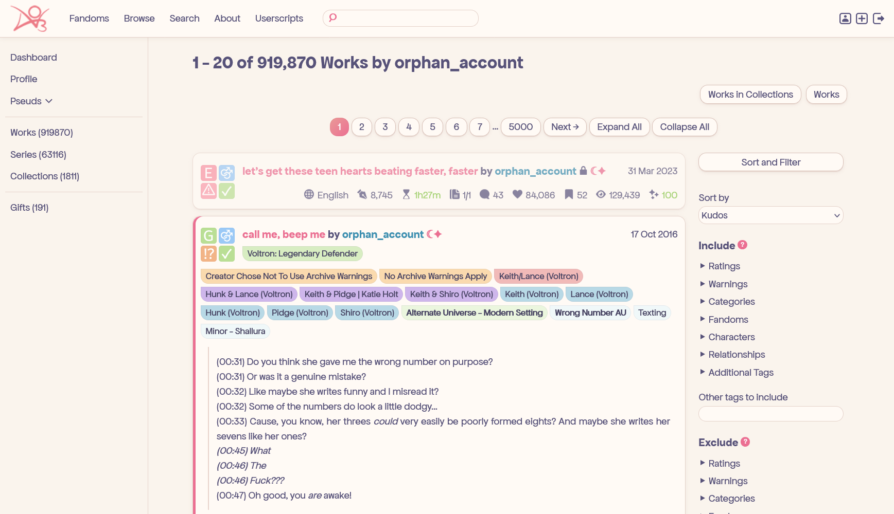 | 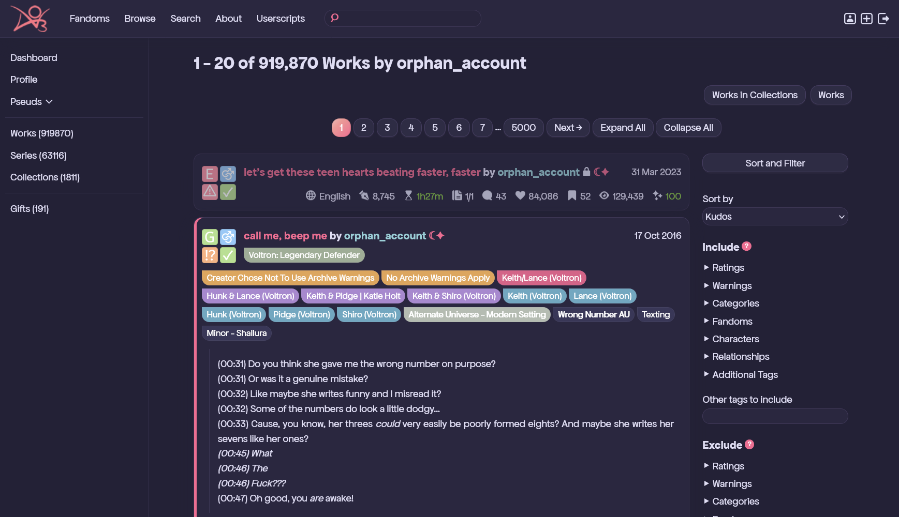 | 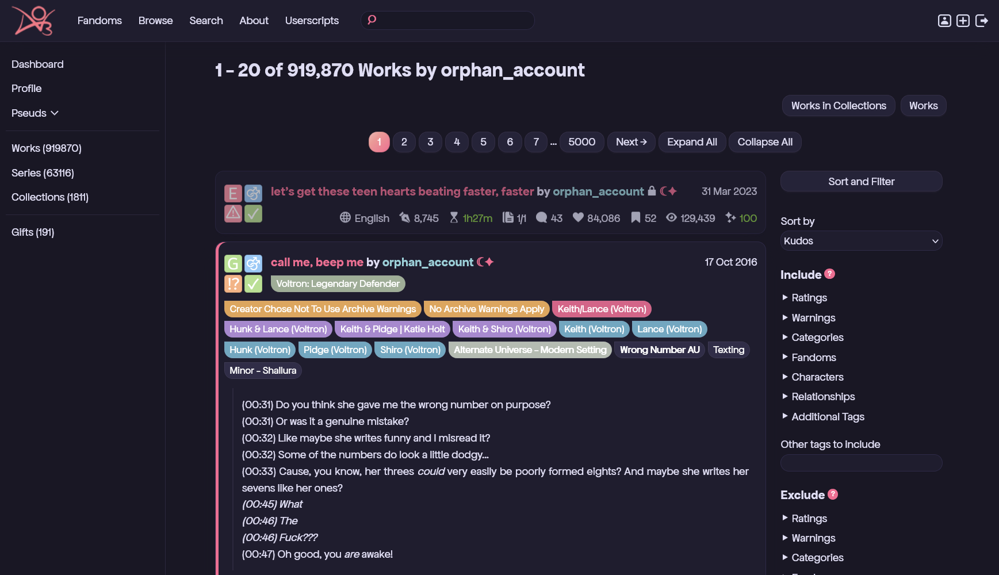 |

| Mobile | Tablet | Content Icons |
| --- | --- | --- |
| 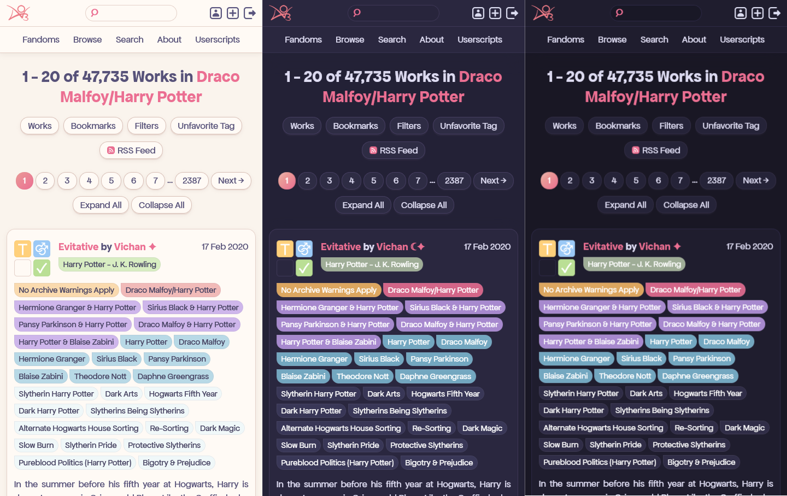 | 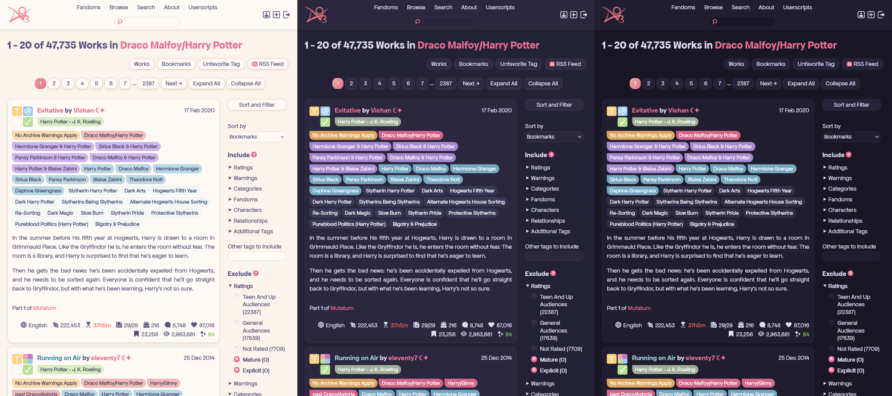 | 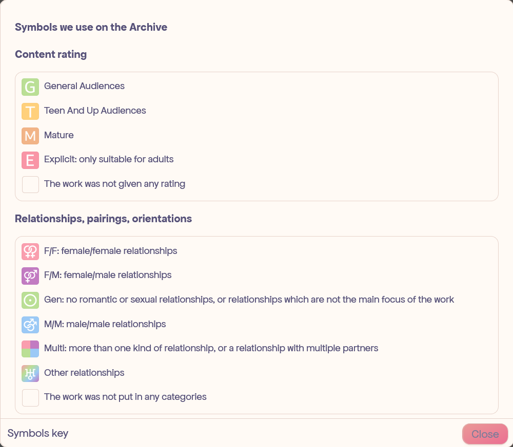 |

</details>

<details>
<summary>Preview Card Layout</summary>

| Rosé Pine Dawn | Rosé Pine Moon | Rosé Pine |
| --- | --- | --- |
| 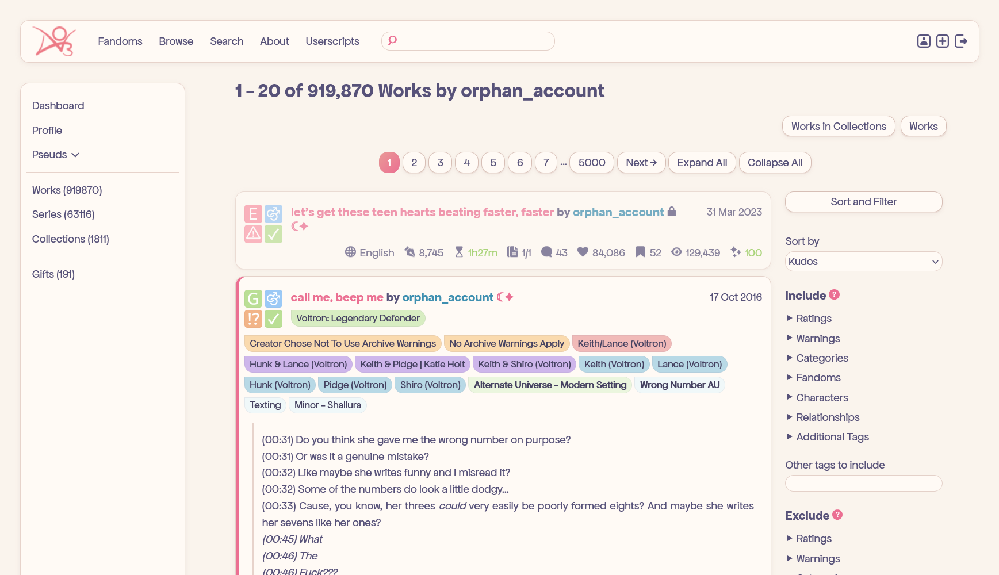 | 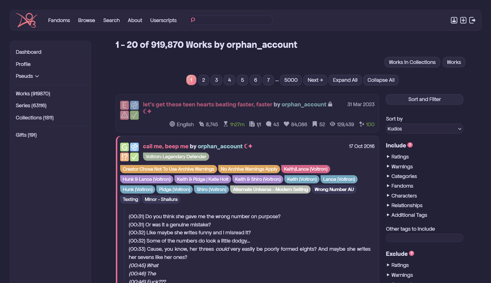 | 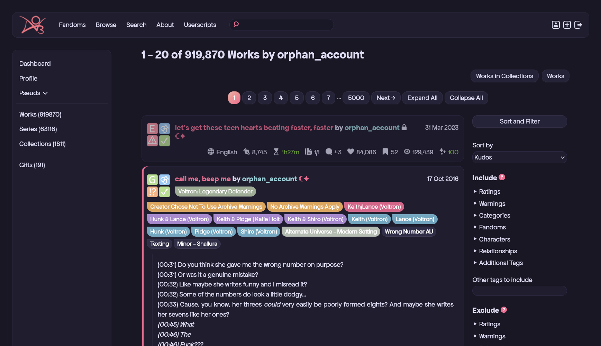 |

| Mobile | Tablet | Content Icons |
| --- | --- | --- |
| 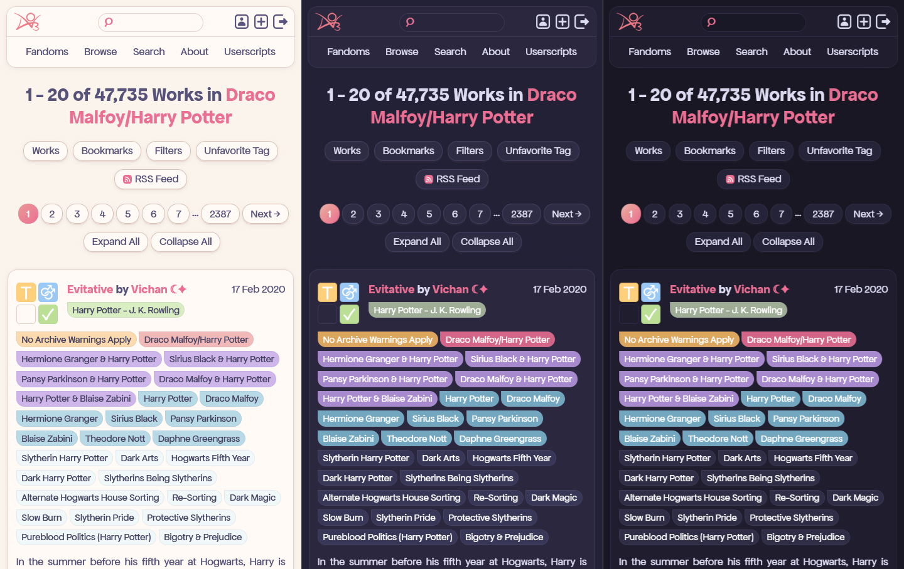 | 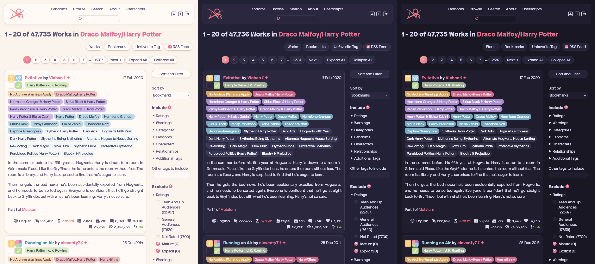 |  |

</details>

---

## Installation

### Choose Your Layout

Before you begin, decide which layout you prefer:

- **Normal Layout:** Uses [`base.css`](https://github.com/ravenothere/AO3-Rose-Pine-Closer-to-Home/blob/main/css/base.css), [`tablet.css`](https://github.com/ravenothere/AO3-Rose-Pine-Closer-to-Home/blob/main/css/tablet.css), and [`mobile.css`](https://github.com/ravenothere/AO3-Rose-Pine-Closer-to-Home/blob/main/css/mobile.css)
- **Card Layout:** Uses [`base_alt.css`](https://github.com/ravenothere/AO3-Rose-Pine-Closer-to-Home/blob/main/css/base_alt.css), [`tablet_alt.css`](https://github.com/ravenothere/AO3-Rose-Pine-Closer-to-Home/blob/main/css/tablet_alt.css), and [`mobile_alt.css`](https://github.com/ravenothere/AO3-Rose-Pine-Closer-to-Home/blob/main/css/mobile_alt.css)

Check the [previews above](#preview) to see which style you prefer, then follow the instructions below using the files for your chosen layout. Note that both layouts use the same theme files, so you can pick any theme you like regardless of which layout you choose.

<details>
<summary><b>Step 1 — Create the base skin</b></summary>

1. Go to **Dashboard → Skins → My Site Skins → [Create Site Skin](https://archiveofourown.org/skins/new?skin_type=Skin)**
2. Name it `[XYZ] Rosé Pine CTH - Base` — Replace `XYZ` with your username or initials.
3. Paste the contents of your chosen base file:
   - Normal layout → [`css/base.css`](https://github.com/ravenothere/AO3-Rose-Pine-Closer-to-Home/blob/main/css/base.css)
   - Card layout → [`css/base_alt.css`](https://github.com/ravenothere/AO3-Rose-Pine-Closer-to-Home/blob/main/css/base_alt.css)
4. Under **Advanced**, set to **Parent Only**
5. Click **Submit**

</details>

<details>
<summary><b>Step 2 — Create a theme skin</b></summary>

1. Create a skin named `[XYZ] Rosé Pine Dawn CTH`, `[XYZ] Rosé Pine Moon CTH`, or `[XYZ] Rosé Pine CTH` — Replace `XYZ` with your username or initials.
2. Paste the contents of your chosen theme file:
   - [`css/theme_rosepinedawn.css`](https://github.com/ravenothere/AO3-Rose-Pine-Closer-to-Home/blob/main/css/theme_rosepinedawn.css)
   - [`css/theme_rosepinemoon.css`](https://github.com/ravenothere/AO3-Rose-Pine-Closer-to-Home/blob/main/css/theme_rosepinemoon.css)
   - [`css/theme_rosepine.css`](https://github.com/ravenothere/AO3-Rose-Pine-Closer-to-Home/blob/main/css/theme_rosepine.css)
3. Set to **Parent Only** and submit

</details>

<details>
<summary><b>Step 2a — Auto light/dark switching (optional)</b></summary>

1. Create a second theme skin (e.g. [Dawn](https://github.com/ravenothere/AO3-Rose-Pine-Closer-to-Home/blob/main/css/theme_rosepinedawn.css) for light, [Moon]((https://github.com/ravenothere/AO3-Rose-Pine-Closer-to-Home/blob/main/css/theme_rosepinemoon.css)) for dark)
2. On your dark theme skin, go to **Advanced → Choose @media** → select `(prefers-color-scheme: dark)`
3. On your light theme skin, select `(prefers-color-scheme: light)`
4. Add both in the parent chain at Step 5 — they'll switch automatically based on your system settings

</details>

<details>
<summary><b>Step 3 — Create the tablet skin</b></summary>

1. Create a skin named `[XYZ] Rosé Pine CTH - Tablet`
2. Paste the contents of your chosen tablet file:
   - Normal layout → [`css/tablet.css`](https://github.com/ravenothere/AO3-Rose-Pine-Closer-to-Home/blob/main/css/tablet.css)
   - Card layout → [`css/tablet_alt.css`](https://github.com/ravenothere/AO3-Rose-Pine-Closer-to-Home/blob/main/css/tablet_alt.css)
3. Under **Advanced → Choose @media**, select `only screen (max-width: 62em)`
4. Set to **Parent Only** and submit

</details>

<details>
<summary><b>Step 4 — Create the mobile skin</b></summary>

1. Create a skin named `[XYZ] Rosé Pine CTH - Mobile`
2. Paste the contents of your chosen mobile file:
   - Normal layout → [`css/mobile.css`](https://github.com/ravenothere/AO3-Rose-Pine-Closer-to-Home/blob/main/css/mobile.css)
   - Card layout → [`css/mobile_alt.css`](https://github.com/ravenothere/AO3-Rose-Pine-Closer-to-Home/blob/main/css/mobile_alt.css)
3. Under **Advanced → Choose @media**, select `only screen (max-width: 42em)`
4. Set to **Parent Only** and submit

</details>

<details>
<summary><b>Step 5 — Chain everything together</b></summary>

1. Create one final skin named `[XYZ] Rosé Pine CTH - Default`
2. In the CSS field paste: `.rose-pine { opacity: 1; }` (placeholder so AO3 lets you save)
3. Under **Advanced → Parent Skins**, add them in this order:
   1. `[XYZ] Rosé Pine CTH - Base`
   2. `[XYZ] Rosé Pine Dawn CTH` / `[XYZ] Rosé Pine Moon CTH` / `[XYZ] Rosé Pine CTH` *(or both if using auto switching)*
   3. `[XYZ] Rosé Pine CTH - Tablet`
   4. `[XYZ] Rosé Pine CTH - Mobile`
4. Click **Submit** then **Use**

</details>

---

## Customization

<details>
<summary><b>Fonts</b></summary>

To change fonts, open your theme skin and use Ctrl+F to search for `font-family`. You'll find four blocks — one for the main site font, one for headings, one for code, and one for works. Replace the first font name in each with your preferred font, keeping the fallbacks:

```css
font-family: YourFont, Apfel Grotezk, Figtree, Bitter, Helvetica, Arial, sans-serif;
```

> **Important:** The fonts must be installed on your device for them to display. If a font isn't installed, the browser will fall back to the next one in the list.

**On mobile:** AO3 can only display fonts already installed on your device. Since installing fonts system-wide on Android doesn't make them available to browsers, the recommended approach is to use the [Stylus](https://addons.mozilla.org/en-US/firefox/addon/styl-us/) extension on Firefox for Android — it can load fonts directly into the browser without needing them installed on your device. The [AO3: Rosé Pine Fonts](https://userstyles.world/style/26908/ao3-rose-pine-fonts) userstyle has the fonts for this skin ready to go — just install it and you're done. If you want to use your own custom fonts on mobile instead, see my [Custom Fonts for Mobile](https://github.com/ravenothere/AO3-Tweaks/tree/main?tab=readme-ov-file#custom-fonts-for-mobile) guide.

</details>

<details>
<summary><b>Font size</b></summary>

In your theme skin, find these two variables near the top:

```css
--txt-size-main: 110%;   /* main text size */
--txt-size-work: 115%;   /* work text size */
```

`--txt-size-main` controls text across the whole site (navigation, blurbs, forms, etc.), while `--txt-size-work` is just for the actual work content. Increase the percentage for larger text or decrease it for smaller. Going above `130%` for `--txt-size-main` may cause minor layout issues.

</details>

<details>
<summary><b>Platonic ship tags</b></summary>

Want platonic ships (relationships with the `&` symbol) to stand out with their own color? Here are pre-made add-on skins with the distinction already built in:

- [Platonic-tags-light.css](https://github.com/ravenothere/AO3-Rose-Pine-Closer-to-Home/blob/main/css/add-ons/platonic-tags/Platonic-tags-light.css) — for Dawn / light theme
- [Platonic-tags-dark.css](https://github.com/ravenothere/AO3-Rose-Pine-Closer-to-Home/blob/main/css/add-ons/platonic-tags/Platonic-tags-dark.css) — for Moon, Rosé Pine / dark themes

Add whichever matches your theme to the parent chain after your theme skin. If you're using auto light/dark switching, add both.

</details>

---

## More Add-ons

Want to take things further? Check out my **[AO3 Tweaks](https://github.com/ravenothere/AO3-Tweaks)** — a collection of standalone add-ons that work with any AO3 skin, including this one:

- **[LGBTQ+ color coded tags](https://github.com/ravenothere/AO3-Tweaks#lgbtq-color-coded-tags)** — highlight LGBTQ+ related tags with their corresponding pride flag colors
- **[EPUB download button](https://github.com/ravenothere/AO3-Tweaks#epub-download-button)** — adds an EPUB download button directly on work blurbs while you're browsing
- ...and a growing list of small quality-of-life tweaks

Drop any of them into your parent chain and they just work!

---

## What's Different

### [`base.css`](https://github.com/ravenothere/AO3-Rose-Pine-Closer-to-Home/blob/main/css/base.css) & [`base_alt.css`](https://github.com/ravenothere/AO3-Rose-Pine-Closer-to-Home/blob/main/css/base_alt.css)

| What changed | Section |
|-------------|---------|
| Header item alignment changed from `flex-start` to `center` — logo, text, and icons are now centered in the header for a more aligned look on desktop and tablet | Header |
| Logo color changed to match the Rosé Pine palette | Header |
| Added `padding-block: 0.5em` to the header so the logo has breathing room from the top and bottom edges on desktop | Header |
| Removed the custom blurb header layout — fandom tags, rating icons, and work titles go back to their original AO3 positions, adjusted bookmark title padding from `14ch` to `6ch` | Blurb Header Layout |

> Both the Normal Layout ([`base.css`](https://github.com/ravenothere/AO3-Rose-Pine-Closer-to-Home/blob/main/css/base.css)) and Card Layout ([`base_alt.css`](https://github.com/ravenothere/AO3-Rose-Pine-Closer-to-Home/blob/main/css/base_alt.css)) received the same changes.

---

### [`theme_rosepinedawn.css`](https://github.com/ravenothere/AO3-Rose-Pine-Closer-to-Home/blob/main/css/theme_rosepinedawn.css), [`theme_rosepinemoon.css`](https://github.com/ravenothere/AO3-Rose-Pine-Closer-to-Home/blob/main/css/theme_rosepinemoon.css) & [`theme_rosepine.css`](https://github.com/ravenothere/AO3-Rose-Pine-Closer-to-Home/blob/main/css/theme_rosepine.css)

| What changed | Section |
|-------------|---------|
| Content icon border radius changed from `0.75rem` (fully round) to `0.25rem` (round-edged square, closer to default AO3) | Icon Border Radius |
| Main text size bumped from `100%` to `110%`, work text size from `110%` to `115%` — slightly larger to compensate for the custom font rendering smaller | Text Size |
| All content icon colors replaced with pastel tones closer to the default AO3 palette | Icon Colors |
| Tag background colors changed to softer pastels for easier readability | Tag Colors |
| Changed the fonts and added work fonts — check out the [Customization](#customization) section to add your own | Fonts |
| Removed all text decorations (✿ in header title, dashboard tab, section headings, and freeform tags) | Text Decorations |

> All three theme files received the same changes. [`theme_rosepinedawn.css`](https://github.com/ravenothere/AO3-Rose-Pine-Closer-to-Home/blob/main/css/theme_rosepinedawn.css) additionally has explicit tag text colors set to `#464261` for better readability on the light background.

---

### [`mobile.css`](https://github.com/ravenothere/AO3-Rose-Pine-Closer-to-Home/blob/main/css/mobile.css) & [`mobile_alt.css`](https://github.com/ravenothere/AO3-Rose-Pine-Closer-to-Home/blob/main/css/mobile_alt.css)

| What changed | Section |
|-------------|---------|
| Removed the `"AO3 ✿"` header title fix — handled directly in the skin | Header |
| Added `padding-block: 0` to reset the header padding added in the base skin — keeps the layout compact | Header |

---

### [`tablet.css`](https://github.com/ravenothere/AO3-Rose-Pine-Closer-to-Home/blob/main/css/tablet.css) & [`tablet_alt.css`](https://github.com/ravenothere/AO3-Rose-Pine-Closer-to-Home/blob/main/css/tablet_alt.css)

| What changed | Section |
|-------------|---------|
| Added `padding-block: 0` to reset the header padding added in the base skin — keeps the layout compact | Header |

---

## Credits

All credit for the original skin goes to [Wolfbatcat](https://github.com/Wolfbatcat/ao3-rose-pine).  
and [neos by ZerafinaCSS](https://github.com/ZerafinaCSS/neos) as its foundation.
